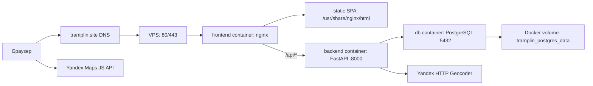

# Трамплин

Трамплин — интерактивная карьерная платформа для студентов, выпускников, работодателей, кураторов и администратора.

В проекте есть:

- главная страница с интерактивной картой и лентой возможностей
- карточки вакансий, стажировок, менторских программ и событий
- ролевая модель: `applicant`, `employer`, `curator`, `admin`
- отклики и статусы откликов
- нетворкинг между соискателями
- базовая SEO-подготовка (Sitemap, Robots.txt, Яндекс Метрика, Яндекс Вебмастер, Google Search Console)
- ручная модерация работодателей: до верификации работодатель может создать до 5 карточек, а демо-автоверификация включается переменной `TRAMPLIN_AUTO_VERIFY_EMPLOYERS`

## Стек

- **Backend**: `FastAPI`, `SQLAlchemy`, `Alembic`, `PostgreSQL`
- **Frontend**: `JavaScript`, `Node.js`, `Vite`, `Bootstrap`
- **Интеграции**: `Yandex Maps JavaScript API`, `Yandex HTTP Geocoder`, `Яндекс Метрика`

## Структура проекта

- `backend/` — API, модели, миграции и доступ к базе данных
- `frontend/` — клиентское приложение на Vite

## Production-архитектура

В production проект запускается через `docker-compose.yml` как три контейнера:



- наружу опубликован только `frontend`-контейнер на портах `80` и `443`
- nginx внутри `frontend` отдает собранный Vite frontend и проксирует `/api/*` в backend
- backend доступен только внутри Docker-сети по имени `backend:8000`
- PostgreSQL доступен только внутри Docker-сети по имени `db:5432`
- данные PostgreSQL хранятся в named volume `tramplin_postgres_data`, а не внутри контейнера
- TLS-сертификаты Let's Encrypt лежат на VPS в `/etc/letsencrypt` и монтируются в nginx read-only
- backend при старте применяет Alembic-миграции и затем запускает FastAPI через Uvicorn
- `www.tramplin.site` редиректит на canonical-домен `tramplin.site`
- nginx добавляет security headers, CSP и долгий immutable-cache для собранных `/assets/*`

## Что нужно для запуска

- `git`
- `Python 3.11`
- `pip`
- `Node.js 20+`
- `npm`

Если на macOS не установлен `python3.11`, можно поставить его через Homebrew:

```bash
brew install python@3.11
```

## Клонирование репозитория

```bash
git clone https://github.com/NerdySnake6/if-else-hackathon-2026.git
cd if-else-hackathon-2026
```

## Переменные окружения

Перед запуском нужны два файла:

1. `backend/.env`
2. `frontend/.env.local`

Файлы `backend/.env.example` и `frontend/.env.example` лежат в репозитории как шаблоны.

### Как получить ключ Яндекс Карт

1. Перейди на [Yandex Maps API](https://yandex.ru/maps-api/)
2. Открой личный кабинет
3. Нажми `Подключить API`
4. Выбери пакет `JavaScript API и HTTP Геокодер`
5. Создай новый ключ

В проекте используется один и тот же ключ для frontend и backend.

### `backend/.env`

Создай файл `backend/.env`:

```env
YANDEX_GEOCODER_API_KEY=твой_ключ_яндекс_карт
```

Где:

- `YANDEX_GEOCODER_API_KEY` — ключ Яндекс Карт

### `frontend/.env.local`

Создай файл `frontend/.env.local`:

```env
VITE_YANDEX_MAPS_API_KEY=твой_ключ_яндекс_карт
```

Где:

- `VITE_YANDEX_MAPS_API_KEY` — тот же ключ, что и в `backend/.env`

Важно:

- backend автоматически читает `backend/.env` при запуске
- после изменения `backend/.env` или `frontend/.env.local` нужно перезапустить backend и frontend

## Быстрый старт на macOS / Linux

### 1. Запуск backend

```bash
cd backend
python3.11 -m venv venv
source venv/bin/activate
pip install -r requirements.txt
python3.11 -m alembic upgrade head
uvicorn app.main:app 
```

Backend будет доступен по адресу:

- [http://127.0.0.1:8000](http://127.0.0.1:8000)
- Swagger: [http://127.0.0.1:8000/docs](http://127.0.0.1:8000/docs)

### 2. Запуск frontend

Открой второй терминал:

```bash
cd frontend
npm install
npm run dev
```

Frontend будет доступен по адресу:

- [http://127.0.0.1:5173](http://127.0.0.1:5173)

Во время локальной разработки frontend отправляет запросы в backend через Vite proxy на `http://localhost:8000`.

## Быстрый старт на Windows

### 1. Запуск backend

```bash
cd backend
py -3.11 -m venv venv
venv\Scripts\activate
pip install -r requirements.txt
python -m alembic upgrade head
uvicorn app.main:app 
```

### 2. Запуск frontend

Открой второй терминал:

```bash
cd frontend
npm install
npm run dev
```

Адреса останутся теми же:

- backend: [http://127.0.0.1:8000](http://127.0.0.1:8000)
- frontend: [http://127.0.0.1:5173](http://127.0.0.1:5173)

## Запуск через Docker на VPS

В репозитории есть готовая Docker-конфигурация:

- `docker-compose.yml` — поднимает PostgreSQL, backend и frontend
- `backend/Dockerfile` — FastAPI, Alembic и PostgreSQL-драйвер
- `frontend/Dockerfile` — production-сборка Vite и nginx

### 1. Подготовить переменные окружения

Создай файл `.env` в корне проекта:

```bash
cp docker.env.example .env
```

Заполни значения:

```env
YANDEX_GEOCODER_API_KEY=твой_ключ_яндекс_карт
VITE_YANDEX_MAPS_API_KEY=твой_ключ_яндекс_карт
TRAMPLIN_SECRET_KEY=случайная_длинная_строка
TRAMPLIN_ADMIN_EMAIL=admin@example.com
TRAMPLIN_ADMIN_PASSWORD=надежный_пароль
TRAMPLIN_ADMIN_NAME=Администратор
TRAMPLIN_AUTO_VERIFY_EMPLOYERS=false
SMTP_HOST=smtp-relay.brevo.com
SMTP_PORT=465
SMTP_USERNAME=логин_SMTP_из_Brevo
SMTP_PASSWORD=ключ_SMTP_из_Brevo
SMTP_FROM_EMAIL=noreply@tramplin.site
SMTP_FROM_NAME=Tramplin
BACKEND_PUBLIC_URL=https://tramplin.site/api
FRONTEND_PUBLIC_URL=https://tramplin.site
EMAIL_VERIFICATION_TTL_MINUTES=60
AI_FEATURES_ENABLED=false
POLZA_API_KEY=ключ_API_из_Polza
POLZA_API_BASE_URL=https://polza.ai/api/v1
POLZA_MODEL=openai/gpt-5.4-mini
AI_REQUEST_TIMEOUT_SECONDS=20
AI_MAX_OUTPUT_TOKENS=3000
FRONTEND_PORT=80
FRONTEND_HTTPS_PORT=443
```

### 2. Подключить отправку писем через Brevo

Email-подтверждение использует SMTP и отправляет письма от имени `noreply@tramplin.site`.
Секреты почты хранятся только в `.env` на VPS.

1. Создай аккаунт Brevo и подтверди email аккаунта.
2. В разделе `Transactional` открой `Senders, Domains, IPs`.
3. Добавь и аутентифицируй домен `tramplin.site`.
4. В DNS домена добавь записи, которые покажет Brevo. Для текущей настройки нужны:

```text
TXT    @                  brevo-code:код_из_Brevo
CNAME  brevo1._domainkey  b1.tramplin-site.dkim.brevo.com
CNAME  brevo2._domainkey  b2.tramplin-site.dkim.brevo.com
TXT    _dmarc             v=DMARC1; p=none; rua=mailto:rua@dmarc.brevo.com
```

5. После статуса `Authenticated` создай sender `Tramplin <noreply@tramplin.site>`.
6. В разделе `SMTP & API` сгенерируй новый SMTP key.
7. Вставь SMTP login в `SMTP_USERNAME`, а новый SMTP key в `SMTP_PASSWORD` в `.env` на VPS.

Если письма не отправляются, проверь `docker compose logs -f backend`, правильность `SMTP_USERNAME`/`SMTP_PASSWORD`, статус sender и аутентификацию домена в Brevo.

### 3. Включить AI-функции через Polza.ai

AI-функции работают через backend, поэтому API-ключ не попадает во frontend и не виден пользователю в браузере.
Если ключ не задан или `AI_FEATURES_ENABLED=false`, сайт продолжает работать без AI-подсказок.

1. В Polza.ai создай API key для OpenAI-compatible API.
2. В `.env` на VPS укажи:

```env
AI_FEATURES_ENABLED=true
POLZA_API_KEY=твой_ключ_Polza
POLZA_API_BASE_URL=https://polza.ai/api/v1
POLZA_MODEL=openai/gpt-5.4-mini
AI_REQUEST_TIMEOUT_SECONDS=20
AI_MAX_OUTPUT_TOKENS=3000
```

3. Перезапусти backend, чтобы он перечитал `.env`:

```bash
cd ~/tramplin
docker compose stop backend
docker compose rm -f backend
docker compose up -d backend
```

4. Проверь статус интеграции:

```bash
curl https://tramplin.site/api/ai/status
```

В ответе `ready` должен быть `true`, если AI включен и ключ задан.

Модель выбирается не при создании API-ключа, а в каждом запросе через `POLZA_MODEL`.
Используй ID из каталога моделей Polza.ai в формате `provider/model`, например `openai/gpt-5.4-mini`.
`AI_MAX_OUTPUT_TOKENS` ограничивает длину ответа модели и по умолчанию оставлен с запасом для полных карточек возможностей.

AI-сценарии для демонстрации:

- работодатель нажимает `AI-помощник` в форме вакансии/стажировки и получает улучшенное описание, теги и предупреждения о недостающих данных;
- куратор нажимает `AI-проверка` в карточке возможности и получает риск-уровень, причины и чеклист ручной модерации;
- соискатель нажимает `Сгенерировать с AI` в форме отклика и получает черновик сопроводительного письма.

Во всех сценариях AI только предлагает черновик. Финальное решение остается за пользователем или куратором.

### 4. Запустить проект

```bash
docker compose up -d --build
```

После запуска:

- frontend будет доступен на `https://tramplin.site/`
- backend будет доступен внутри Docker-сети как `backend:8000`
- Swagger и OpenAPI в production закрыты nginx-конфигом

### 5. Проверить состояние контейнеров

```bash
docker compose ps
docker compose logs -f backend
```

При старте backend ждет готовности PostgreSQL и автоматически применяет миграции Alembic.

### Миграция старой SQLite-базы в PostgreSQL

Если нужно перенести данные из прежней SQLite-базы, скрипт `backend/migrate_data.py` можно запускать внутри backend-контейнера. Файл SQLite должен быть доступен в контейнере.

```bash
docker compose cp /root/tramplin/tramplin_backup.db backend:/app/tramplin_backup.db
docker compose exec backend env TRAMPLIN_SQLITE_BACKUP_PATH=/app/tramplin_backup.db python migrate_data.py
```

Можно указать путь через `TRAMPLIN_SQLITE_BACKUP_PATH` или полный SQLAlchemy URL через `TRAMPLIN_SQLITE_BACKUP_URL`.
После переноса скрипт синхронизирует PostgreSQL sequences, чтобы новые записи получали свободные `id`.

## Первый администратор

После применения миграций и первого запуска backend в базе автоматически создается один администратор, если пользователя с ролью `admin` еще нет и явно заданы переменные окружения администратора.

Это происходит после выполнения команд:

```bash
cd backend
source venv/bin/activate
python3.11 -m alembic upgrade head
uvicorn app.main:app --reload
```

Перед первым запуском задай данные администратора в окружении:

```env
TRAMPLIN_ADMIN_EMAIL=admin@example.com
TRAMPLIN_ADMIN_PASSWORD=надежный_пароль
TRAMPLIN_ADMIN_NAME=Администратор
```

Важно:

- администратор создается только если в БД еще нет роли `admin`
- если `TRAMPLIN_ADMIN_EMAIL` или `TRAMPLIN_ADMIN_PASSWORD` не заданы, администратор автоматически не создается
- в базе хранится не открытый пароль, а его хеш
- входить нужно обычным паролем, который был задан при инициализации
- `TRAMPLIN_AUTO_VERIFY_EMPLOYERS=false` оставляет ручную модерацию работодателей; значение `true` стоит включать только для закрытого демо-режима

При необходимости данные администратора можно переопределить через переменные окружения backend.

## Что проверить после запуска

1. Открывается frontend на `http://127.0.0.1:5173`
2. Открывается backend на `http://127.0.0.1:8000/docs`
3. На главной странице отображаются карта и карточки возможностей
4. Можно войти под администратором, заданным через переменные окружения

## CI/CD

В репозитории настроены GitHub Actions:

- `.github/workflows/ci.yml` — проверка backend и сборка frontend для `push` и `pull_request`
- `.github/workflows/cd.yml` — сборка артефактов на ветке `main`

CI проверяет:

- синтаксис Python-модулей backend
- backend-тесты основных сценариев
- production-сборку frontend

Для workflow может понадобиться GitHub Secret:

- `VITE_YANDEX_MAPS_API_KEY`

## Полезные замечания

- если маркеры на карте не появляются, сначала проверь `YANDEX_GEOCODER_API_KEY`, `VITE_YANDEX_MAPS_API_KEY` и CSP в `frontend/nginx.conf`
- если менялись `.env`-файлы, всегда перезапускай backend и frontend
- если база не совпадает с миграциями, backend попросит сначала выполнить `alembic upgrade head`

## Проект в сети

Ознакомиться с рабочей версией проекта можно на **[официальном сайте «Трамплин»](https://tramplin.site/)**.

Видеообзор проекта доступен на **[VK Видео](https://vkvideo.ru/video-237170920_456239017)**.
