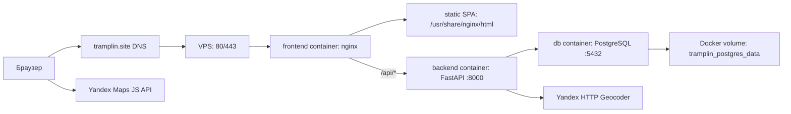

# Трамплин

Трамплин — интерактивная карьерная платформа для студентов, выпускников, работодателей, кураторов и администратора.


## В проекте реализовано:

- **Интерактивная карта и лента возможностей:** главная страница с фильтрами по типу возможностей (стажировка, вакансия, менторство, событие), формату работы, локации и уровню вознаграждения.
- **Ролевая модель:** разделение доступа на соискателей (`applicant`), работодателей (`employer`), кураторов (`curator`) и администраторов (`admin`).
- **Отклики и нетворкинг:** отправка откликов с сопроводительными письмами, отслеживание статусов, а также поиск контактов и нетворкинг между студентами.
- **Интеграция с AI (Polza.ai API):**
  * *AI-помощник работодателя:* автоматическое улучшение описания вакансий (без раскрытия служебной диагностики в публичном тексте), умный подбор тегов из каталога и генерация предупреждений.
  * *AI-сопроводительные письма:* генерация релевантных черновиков сопроводительных писем для студентов на основе их профиля и деталей карточки компании.
- **Двухуровневая система модерации:**
  * *Rule-based фильтр:* автоматическое сканирование описаний на запрещенные темы (обналичивание, финансовые дропы, сомнительная доставка, залог за обучение/инвентарь).
  * *AI-ассистент куратора:* разметка рисков (low/medium/high), интерактивный чеклист для проверки и подсветка подозрительных цитат в карточке.
- **Валидация финансовых условий:** защита от мусорных числовых строк в поле вознаграждения с поддержкой корректных диапазонов в реалистичном спектре от 0 до 3 000 000 рублей.
- **Базовая SEO-подготовка:** динамическая генерация `Sitemap.xml` и `Robots.txt`, оптимизация мета-тегов, canonical URL и интеграция с метриками аналитики.
- **Модерация работодателей:** ограничение на создание карточек (до 5 штук) для новых/неверифицированных аккаунтов. Демо-автоверификация настраивается переменной `TRAMPLIN_AUTO_VERIFY_EMPLOYERS`.

## Стек

- **Backend**: `FastAPI`, `SQLAlchemy`, `Alembic`, `PostgreSQL`
- **Frontend**: `JavaScript`, `Node.js`, `Vite`, `Bootstrap`
- **Интеграции**: `Yandex Maps JavaScript API`, `Yandex HTTP Geocoder`, `Яндекс Метрика`

## Структура проекта

- `backend/` — API, модели, миграции и доступ к базе данных
- `frontend/` — клиентское приложение на Vite

## Production-архитектура

В production проект запускается через `docker-compose.yml` как три контейнера:



- наружу опубликован только `frontend`-контейнер на портах `80` и `443`
- nginx внутри `frontend` отдает собранный Vite frontend и проксирует `/api/*` в backend
- backend доступен только внутри Docker-сети по имени `backend:8000`
- PostgreSQL доступен только внутри Docker-сети по имени `db:5432`
- данные PostgreSQL хранятся в named volume `tramplin_postgres_data`, а не внутри контейнера
- TLS-сертификаты Let's Encrypt лежат на VPS в `/etc/letsencrypt` и монтируются в nginx read-only
- backend при старте применяет Alembic-миграции и затем запускает FastAPI через Uvicorn
- `www.tramplin.site` редиректит на canonical-домен `tramplin.site`
- nginx добавляет security headers, CSP и долгий immutable-cache для собранных `/assets/*`

## Что нужно для запуска

- `git`
- `Docker Engine`
- `Docker Compose v2` (`docker compose version`)
- `Python 3.11`
- `pip`
- `Node.js 20+`
- `npm`

Если на macOS не установлен `python3.11`, можно поставить его через Homebrew:

```bash
brew install python@3.11
```

## Клонирование репозитория

```bash
git clone https://github.com/NerdySnake6/if-else-hackathon-2026.git
cd if-else-hackathon-2026
```

## Переменные окружения

Для локальной разработки обычно нужны два файла:

1. `backend/.env`
2. `frontend/.env.local`

Файлы `backend/.env.example` и `frontend/.env.example` лежат в репозитории как шаблоны.
Для production на VPS используется один общий файл `.env` в корне проекта, он описан ниже в разделе Docker.

### Как получить ключ Яндекс Карт

1. Перейди на [Yandex Maps API](https://yandex.ru/maps-api/)
2. Открой личный кабинет
3. Нажми `Подключить API`
4. Выбери пакет `JavaScript API и HTTP Геокодер`
5. Создай новый ключ

В проекте используется один и тот же ключ для frontend и backend.

### `backend/.env`

Создай файл `backend/.env`:

```env
YANDEX_GEOCODER_API_KEY=твой_ключ_яндекс_карт
POSTGRES_USER=tramplin_user
POSTGRES_PASSWORD=tramplin_password
POSTGRES_DB=tramplin_db
POSTGRES_HOST=localhost
POSTGRES_PORT=5432
TRAMPLIN_SECRET_KEY=локальная_случайная_строка
TRAMPLIN_ADMIN_EMAIL=admin@example.com
TRAMPLIN_ADMIN_PASSWORD=admin12345
TRAMPLIN_ADMIN_NAME=Администратор
```

Где:

- `YANDEX_GEOCODER_API_KEY` — ключ Яндекс Карт
- `POSTGRES_*` — параметры локального PostgreSQL
- `TRAMPLIN_SECRET_KEY` — секрет подписи JWT-токенов
- `TRAMPLIN_ADMIN_*` — данные первого администратора для локальной базы

### `frontend/.env.local`

Создай файл `frontend/.env.local`:

```env
VITE_YANDEX_MAPS_API_KEY=твой_ключ_яндекс_карт
```

Где:

- `VITE_YANDEX_MAPS_API_KEY` — тот же ключ, что и в `backend/.env`

Важно:

- backend автоматически читает `backend/.env` при запуске
- после изменения `backend/.env` или `frontend/.env.local` нужно перезапустить backend и frontend
- если локального PostgreSQL нет, проще всего запускать весь проект через Docker Compose

## Быстрый старт на macOS / Linux

### 1. Запуск PostgreSQL для локального backend

Для запуска backend вне Docker нужен PostgreSQL, доступный на `localhost:5432`.
Создай базу и пользователя с параметрами из `backend/.env` или укажи свой `TRAMPLIN_DATABASE_URL`.
Если не хочешь ставить PostgreSQL локально, запускай проект целиком через Docker на сервере или подключи backend к уже доступной PostgreSQL-базе.

### 2. Запуск backend

```bash
cd backend
python3.11 -m venv venv
source venv/bin/activate
pip install -r requirements.txt
python3.11 -m alembic upgrade head
uvicorn app.main:app --reload
```

Backend будет доступен по адресу:

- [http://127.0.0.1:8000](http://127.0.0.1:8000)
- Swagger: [http://127.0.0.1:8000/docs](http://127.0.0.1:8000/docs)

### 3. Запуск frontend

Открой второй терминал:

```bash
cd frontend
npm install
npm run dev
```

Frontend будет доступен по адресу:

- [http://127.0.0.1:5173](http://127.0.0.1:5173)

Во время локальной разработки frontend отправляет запросы в backend через Vite proxy на `http://localhost:8000`.

## Быстрый старт на Windows

### 1. Запуск PostgreSQL для локального backend

Для запуска backend вне Docker нужен PostgreSQL, доступный на `localhost:5432`.
Создай базу и пользователя с параметрами из `backend/.env` или укажи свой `TRAMPLIN_DATABASE_URL`.

### 2. Запуск backend

```bash
cd backend
py -3.11 -m venv venv
venv\Scripts\activate
pip install -r requirements.txt
python -m alembic upgrade head
uvicorn app.main:app --reload
```

### 3. Запуск frontend

Открой второй терминал:

```bash
cd frontend
npm install
npm run dev
```

Адреса останутся теми же:

- backend: [http://127.0.0.1:8000](http://127.0.0.1:8000)
- frontend: [http://127.0.0.1:5173](http://127.0.0.1:5173)

## Запуск через Docker на VPS

В репозитории есть готовая Docker-конфигурация:

- `docker-compose.yml` — поднимает PostgreSQL, backend и frontend
- `backend/Dockerfile` — FastAPI, Alembic и PostgreSQL-драйвер
- `frontend/Dockerfile` — production-сборка Vite и nginx

Для production используется Docker Compose v2, то есть команды вида `docker compose ...`.
Старая команда `docker-compose` не нужна.

### 1. Первый запуск на новом сервере

```bash
cd ~
git clone https://github.com/NerdySnake6/if-else-hackathon-2026.git tramplin
cd ~/tramplin
cp docker.env.example .env
nano .env
```

Заполни `.env`, затем собери и подними все сервисы:

```bash
docker compose up -d --build
docker compose ps
```

Что произойдет при первом запуске:

- поднимется `db` на PostgreSQL 16;
- поднимется `backend`, дождется PostgreSQL, применит Alembic-миграции и запустит FastAPI;
- если в базе еще нет администратора и заданы `TRAMPLIN_ADMIN_EMAIL`/`TRAMPLIN_ADMIN_PASSWORD`, backend создаст первого администратора;
- поднимется `frontend` с nginx, который отдаст сайт и проксирует `/api/*` в backend.

### 2. Переменные окружения для VPS

Создай файл `.env` в корне проекта:

```bash
cp docker.env.example .env
```

Заполни значения:

```env
YANDEX_GEOCODER_API_KEY=твой_ключ_яндекс_карт
VITE_YANDEX_MAPS_API_KEY=твой_ключ_яндекс_карт
TRAMPLIN_SECRET_KEY=случайная_длинная_строка
TRAMPLIN_ADMIN_EMAIL=admin@example.com
TRAMPLIN_ADMIN_PASSWORD=надежный_пароль
TRAMPLIN_ADMIN_NAME=Администратор
TRAMPLIN_AUTO_VERIFY_EMPLOYERS=false
SMTP_HOST=smtp-relay.brevo.com
SMTP_PORT=587
SMTP_USERNAME=логин_SMTP_из_Brevo
SMTP_PASSWORD=ключ_SMTP_из_Brevo
SMTP_FROM_EMAIL=noreply@tramplin.site
SMTP_FROM_NAME=Tramplin
BACKEND_PUBLIC_URL=https://tramplin.site/api
FRONTEND_PUBLIC_URL=https://tramplin.site
EMAIL_VERIFICATION_TTL_MINUTES=60
AI_FEATURES_ENABLED=false
POLZA_API_KEY=ключ_API_из_Polza
POLZA_API_BASE_URL=https://polza.ai/api/v1
POLZA_MODEL=openai/gpt-5.4-mini
AI_REQUEST_TIMEOUT_SECONDS=20
AI_MAX_OUTPUT_TOKENS=3000
AI_RATE_LIMIT_WINDOW_SECONDS=60
AI_RATE_LIMIT_MAX_REQUESTS=10
FRONTEND_PORT=80
FRONTEND_HTTPS_PORT=443
```

Важно:

- `.env` в корне проекта используется Docker Compose и не должен попадать в git;
- после изменения backend-переменных нужно пересоздать backend-контейнер;
- после изменения `VITE_YANDEX_MAPS_API_KEY` нужно пересобрать frontend, потому что ключ попадает в production-сборку Vite;
- `POLZA_API_KEY`, SMTP-пароль, `TRAMPLIN_SECRET_KEY` и пароль PostgreSQL остаются только на backend/VPS;
- `VITE_YANDEX_MAPS_API_KEY` является публичным frontend-ключом, поэтому ограничения для него настраиваются в кабинете Яндекса.

### 3. Подключить отправку писем через Brevo

Email-подтверждение использует SMTP и отправляет письма от имени `noreply@tramplin.site`.
Секреты почты хранятся только в `.env` на VPS.

1. Создай аккаунт Brevo и подтверди email аккаунта.
2. В разделе `Transactional` открой `Senders, Domains, IPs`.
3. Добавь и аутентифицируй домен `tramplin.site`.
4. В DNS домена добавь записи, которые покажет Brevo. Для текущей настройки нужны:

```text
TXT    @                  brevo-code:код_из_Brevo
CNAME  brevo1._domainkey  b1.tramplin-site.dkim.brevo.com
CNAME  brevo2._domainkey  b2.tramplin-site.dkim.brevo.com
TXT    _dmarc             v=DMARC1; p=none; rua=mailto:rua@dmarc.brevo.com
```

5. После статуса `Authenticated` создай sender `Tramplin <noreply@tramplin.site>`.
6. В разделе `SMTP & API` сгенерируй новый SMTP key.
7. Вставь SMTP login в `SMTP_USERNAME`, а новый SMTP key в `SMTP_PASSWORD` в `.env` на VPS.

Если письма не отправляются, проверь `docker compose logs -f backend`, правильность `SMTP_USERNAME`/`SMTP_PASSWORD`, статус sender и аутентификацию домена в Brevo.

Рекомендуемый порт для Brevo: `587` с STARTTLS. Если используешь `465`, проверь, что backend-конфигурация и SMTP-провайдер ожидают SSL-подключение.

### 4. Включить AI-функции через Polza.ai

AI-функции работают через backend, поэтому API-ключ не попадает во frontend и не виден пользователю в браузере.
Если ключ не задан или `AI_FEATURES_ENABLED=false`, сайт продолжает работать без AI-подсказок.

1. В Polza.ai создай API key для OpenAI-compatible API.
2. В `.env` на VPS укажи:

```env
AI_FEATURES_ENABLED=true
POLZA_API_KEY=твой_ключ_Polza
POLZA_API_BASE_URL=https://polza.ai/api/v1
POLZA_MODEL=openai/gpt-5.4-mini
AI_REQUEST_TIMEOUT_SECONDS=20
AI_MAX_OUTPUT_TOKENS=3000
AI_RATE_LIMIT_WINDOW_SECONDS=60
AI_RATE_LIMIT_MAX_REQUESTS=10
```

3. Перезапусти backend, чтобы он перечитал `.env`:

```bash
cd ~/tramplin
docker compose stop backend
docker compose rm -f backend
docker compose up -d backend
```

4. Проверь статус интеграции:

```bash
curl https://tramplin.site/api/ai/status
```

В ответе `ready` должен быть `true`, если AI включен и ключ задан.

Модель выбирается не при создании API-ключа, а в каждом запросе через `POLZA_MODEL`.
Используй ID из каталога моделей Polza.ai в формате `provider/model`, например `openai/gpt-5.4-mini`.
`AI_MAX_OUTPUT_TOKENS` ограничивает длину ответа модели и по умолчанию оставлен с запасом для полных карточек возможностей.
`AI_RATE_LIMIT_WINDOW_SECONDS` и `AI_RATE_LIMIT_MAX_REQUESTS` управляют простым in-memory лимитом AI-запросов на пользователя.

AI-сценарии для демонстрации:

- работодатель нажимает `AI-помощник` в форме вакансии/стажировки и получает улучшенное описание, теги и предупреждения о недостающих данных;
- куратор нажимает `AI-проверка` в карточке возможности и получает риск-уровень, причины и чеклист ручной модерации;
- соискатель нажимает `Сгенерировать с AI` в форме отклика и получает черновик сопроводительного письма.

Во всех сценариях AI только предлагает черновик. Финальное решение остается за пользователем или куратором.

### 5. Проверить production после запуска

```bash
docker compose ps
curl https://tramplin.site/api/health
curl https://tramplin.site/api/ai/status
```

Ожидаемо:

- `db`, `backend`, `frontend` находятся в статусе `Up`;
- `/api/health` возвращает `{"status":"ok"}`;
- `/api/ai/status` показывает текущую модель и `ready=true`, если AI включен;
- frontend доступен на `https://tramplin.site/`;
- Swagger и OpenAPI в production закрыты nginx-конфигом.

### 6. Повседневные команды Docker Compose

Запустить уже собранные контейнеры:

```bash
cd ~/tramplin
docker compose up -d
```

Остановить контейнеры без удаления данных:

```bash
docker compose stop
```

Перезапустить все сервисы:

```bash
docker compose restart
```

Посмотреть состояние:

```bash
docker compose ps
```

Посмотреть логи backend:

```bash
docker compose logs -f backend
```

Посмотреть логи frontend/nginx:

```bash
docker compose logs -f frontend
```

Остановить и удалить контейнеры/сеть, но сохранить PostgreSQL-данные в volume:

```bash
docker compose down
```

Не выполняй `docker compose down -v` на production без осознанного бэкапа: флаг `-v` удалит named volume PostgreSQL с данными.

### 7. Обновление production после нового коммита

Обычный безопасный сценарий:

```bash
cd ~/tramplin
git pull
docker compose up -d --build
docker compose ps
curl https://tramplin.site/api/health
```

Если менялся только `.env` для backend и образы пересобирать не нужно:

```bash
cd ~/tramplin
docker compose up -d --force-recreate backend
curl https://tramplin.site/api/health
```

Если менялся `VITE_YANDEX_MAPS_API_KEY`, пересобери frontend:

```bash
cd ~/tramplin
docker compose build frontend
docker compose up -d frontend
```

### 8. SSL-сертификат и автопродление

Сертификаты Let's Encrypt лежат на VPS в `/etc/letsencrypt` и монтируются в `frontend` read-only.
Так как nginx занимает порт `80`, для standalone-renewal Certbot должен временно останавливать frontend.

Хуки Certbot:

```bash
mkdir -p /etc/letsencrypt/renewal-hooks/pre /etc/letsencrypt/renewal-hooks/post

printf '#!/bin/sh\ncd /root/tramplin && docker compose stop frontend\n' > /etc/letsencrypt/renewal-hooks/pre/stop-frontend.sh
printf '#!/bin/sh\ncd /root/tramplin && docker compose up -d frontend\n' > /etc/letsencrypt/renewal-hooks/post/start-frontend.sh

chmod +x /etc/letsencrypt/renewal-hooks/pre/stop-frontend.sh
chmod +x /etc/letsencrypt/renewal-hooks/post/start-frontend.sh
```

Проверка:

```bash
certbot renew --dry-run
docker compose ps
```

### Миграция старой SQLite-базы в PostgreSQL

Если нужно перенести данные из прежней SQLite-базы, скрипт `backend/migrate_data.py` можно запускать внутри backend-контейнера. Файл SQLite должен быть доступен в контейнере.

```bash
docker compose cp /root/tramplin/tramplin_backup.db backend:/app/tramplin_backup.db
docker compose exec backend env TRAMPLIN_SQLITE_BACKUP_PATH=/app/tramplin_backup.db python migrate_data.py
```

Можно указать путь через `TRAMPLIN_SQLITE_BACKUP_PATH` или полный SQLAlchemy URL через `TRAMPLIN_SQLITE_BACKUP_URL`.
После переноса скрипт синхронизирует PostgreSQL sequences, чтобы новые записи получали свободные `id`.

## Первый администратор

После первого запуска backend в базе автоматически создается один администратор, если пользователя с ролью `admin` еще нет и явно заданы переменные окружения:

```env
TRAMPLIN_ADMIN_EMAIL=admin@example.com
TRAMPLIN_ADMIN_PASSWORD=надежный_пароль
TRAMPLIN_ADMIN_NAME=Администратор
```

Важно:

- администратор создается только если в БД еще нет роли `admin`
- если `TRAMPLIN_ADMIN_EMAIL` или `TRAMPLIN_ADMIN_PASSWORD` не заданы, администратор автоматически не создается
- в базе хранится не открытый пароль, а его хеш
- входить нужно обычным паролем, который был задан при инициализации
- `TRAMPLIN_AUTO_VERIFY_EMPLOYERS=false` оставляет ручную модерацию работодателей; значение `true` стоит включать только для закрытого демо-режима

## Что проверить после запуска

Локально:

1. Открывается frontend на `http://127.0.0.1:5173`
2. Открывается backend на `http://127.0.0.1:8000/docs`
3. На главной странице отображаются карта и карточки возможностей
4. Можно войти под администратором, заданным через переменные окружения

На VPS:

1. `docker compose ps` показывает `db`, `backend`, `frontend` в статусе `Up`
2. `curl https://tramplin.site/api/health` возвращает `{"status":"ok"}`
3. `curl https://tramplin.site/api/ai/status` возвращает корректную модель, если AI включен
4. Регистрация пользователя отправляет письмо подтверждения
5. Новая карточка с физическим адресом получает координаты и появляется на карте после модерации
6. Работают роли `applicant`, `employer`, `curator`, `admin`

## CI/CD

В репозитории настроены GitHub Actions:

- `.github/workflows/ci.yml` — проверка backend и сборка frontend для `push` и `pull_request`
- `.github/workflows/cd.yml` — сборка артефактов на ветке `main`

CI проверяет:

- синтаксис Python-модулей backend
- backend-тесты основных сценариев
- production-сборку frontend

Для workflow может понадобиться GitHub Secret:

- `VITE_YANDEX_MAPS_API_KEY`

## Полезные замечания

- `docker compose build` только собирает образы и не запускает контейнеры; после него нужен `docker compose up -d`
- если маркеры на карте не появляются, сначала проверь `YANDEX_GEOCODER_API_KEY`, `VITE_YANDEX_MAPS_API_KEY`, ограничения ключей в Яндексе, логи backend и CSP в `frontend/nginx.conf`
- если менялись backend-переменные в `.env`, пересоздай backend-контейнер
- если менялись frontend build args, пересобери frontend-контейнер
- если база не совпадает с миграциями, backend применяет Alembic при старте; при ошибке смотри `docker compose logs -f backend`
- если AI долго отвечает, проверь модель `POLZA_MODEL`, timeout, rate limit и telemetry в `docker compose logs -f backend`

## Проект в сети

Ознакомиться с рабочей версией проекта можно на **[официальном сайте «Трамплин»](https://tramplin.site/)**.

Видеообзор проекта доступен на **[VK Видео](https://vkvideo.ru/video-237170920_456239017)**.
